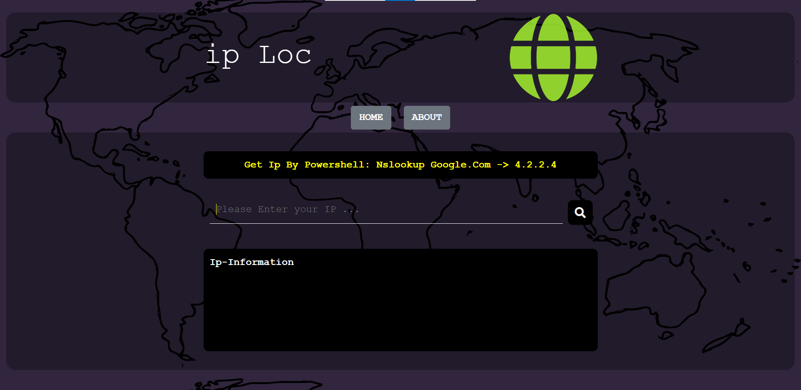
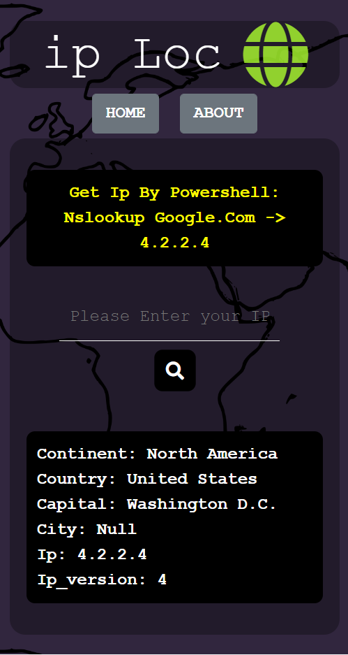

# IP-Loc

<p dir="rtl" align="right">
وب سایت گرفتن اطلاعات ip، با استفاده از این وب سایت شما می توانید آدرس ip مورد نظرتان را جستجو کرده تا اطلاعات لازم را از موقعیت ip بدست اورید.
</p> 

### how to get ip address website:
* cmd / powershell: ``` nslookup google.com ```

## image's:

 


